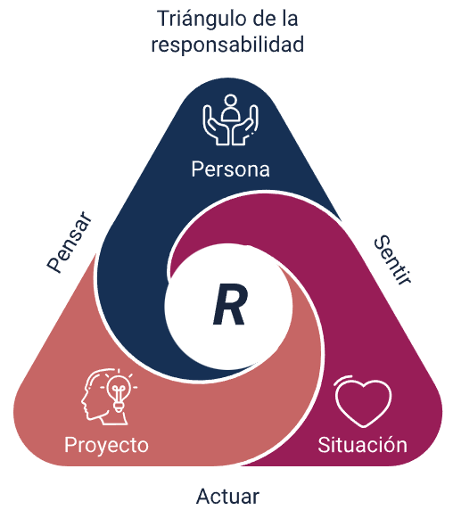

# La importancia del entorno en la toma de decisiones

## Resumen
El entorno juega un papel fundamental en cada decisión que tomamos, desde las más simples como elegir la ropa hasta las más complejas como emprender un negocio. Analizar el contexto permite tomar decisiones más acertadas, considerando factores externos que pueden influir en los resultados.

## Conceptos clave
- El entorno condiciona nuestras decisiones diarias y estratégicas.
- Analizar el contexto es esencial en el emprendimiento.
- Factores como clima, actores y sectores económicos afectan las elecciones.

## Conexiones
- Relacionado con [[toma de decisiones en ajedrez]]
- Relacionado con [[análisis de sectores económicos]]

## Aplicaciones prácticas
Antes de tomar decisiones importantes, ya sea personales o empresariales, es útil analizar el entorno: identificar oportunidades, amenazas, aliados y recursos disponibles. En emprendimiento, esto implica estudiar el sector económico, la competencia y los apoyos existentes.

## Reflexión personal
Aprendí que muchas veces subestimamos la influencia del entorno en nuestras decisiones. Al ser más consciente de estos factores, puedo planificar mejor y anticipar desafíos. Me queda la duda de cómo sistematizar este análisis para que sea parte natural de mi proceso de toma de decisiones.

