# Guía del Usuario de BMad Method

Esta guía te ayudará a entender y usar efectivamente el BMad Method para planificación y desarrollo ágil impulsado por IA.

## El Flujo de BMad

### El Flujo de Planificación (Web UI o IDE Potente)

Antes de que comience el desarrollo, BMad sigue un flujo de planificación estructurado que se realiza idealmente en Web UI para eficiencia de costos:

```mermaid
graph TD
    A["Inicio: Idea del Proyecto"] --> B{"Opcional: Investigación del Analista"}
    B -->|Sí| C["Analista: Lluvia de Ideas (Opcional)"]
    B -->|No| G{"¿Brief del Proyecto Disponible?"}
    C --> C2["Analista: Investigación de Mercado (Opcional)"]
    C2 --> C3["Analista: Análisis de Competidores (Opcional)"]
    C3 --> D["Analista: Crear Brief del Proyecto"]
    D --> G
    G -->|Sí| E["PM: Crear PRD desde Brief (Vía Rápida)"]
    G -->|No| E2["PM: Creación Interactiva de PRD (Más Preguntas)"]
    E --> F["PRD Creado con FRs, NFRs, Épicas y Historias"]
    F --> F2{"¿UX Requerido?"}
    F2 -->|Sí| F3["Experto UX: Crear Especificación de Front End"]
    F2 -->|No| H["Arquitecto: Crear Arquitectura desde PRD"]
    F3 --> F4["Experto UX: Generar Prompt de UI para Lovable/V0 (Opcional)"]
    F4 --> H2["Arquitecto: Crear Arquitectura desde PRD + Especificación UX"]
    H --> Q{"¿Estrategia de Prueba Temprana? (Opcional)"}
    H2 --> Q
    Q -->|Sí| R["QA: Entrada Temprana de Arquitectura de Prueba en Áreas de Alto Riesgo"]
    Q -->|No| I
    R --> I["PO: Ejecutar Lista de Verificación Maestra"]
    I --> J{"¿Documentos Alineados?"}
    J -->|Sí| K["Planificación Completa"]
    J -->|No| L["PO: Actualizar Épicas y Historias"]
    L --> M["Actualizar PRD/Arquitectura según sea necesario"]
    M --> I
    K --> N["📁 Cambiar a IDE (Si está en una Plataforma de Agente Web)"]
    N --> O["PO: Fragmentar Documentos"]
    O --> P["Listo para Ciclo SM/Dev"]

    style A fill:#f5f5f5,color:#000
    style B fill:#e3f2fd,color:#000
    style C fill:#e8f5e9,color:#000
    style C2 fill:#e8f5e9,color:#000
    style C3 fill:#e8f5e9,color:#000
    style D fill:#e8f5e9,color:#000
    style E fill:#fff3e0,color:#000
    style E2 fill:#fff3e0,color:#000
    style F fill:#fff3e0,color:#000
    style F2 fill:#e3f2fd,color:#000
    style F3 fill:#e1f5fe,color:#000
    style F4 fill:#e1f5fe,color:#000
    style G fill:#e3f2fd,color:#000
    style H fill:#f3e5f5,color:#000
    style H2 fill:#f3e5f5,color:#000
    style Q fill:#e3f2fd,color:#000
    style R fill:#ffd54f,color:#000
    style I fill:#f9ab00,color:#fff
    style J fill:#e3f2fd,color:#000
    style K fill:#34a853,color:#fff
    style L fill:#f9ab00,color:#fff
    style M fill:#fff3e0,color:#000
    style N fill:#1a73e8,color:#fff
    style O fill:#f9ab00,color:#fff
    style P fill:#34a853,color:#fff
```



#### Artefactos de Planificación (Rutas Estándar)

```text
PRD              → docs/prd.md
Arquitectura     → docs/architecture.md
Épicas Fragmentadas    → docs/epics/
Historias Fragmentadas  → docs/stories/
Evaluaciones QA   → docs/qa/assessments/
Puertas QA         → docs/qa/gates/
```

### El Ciclo de Desarrollo Principal (IDE)

Una vez que la planificación está completa y los documentos están fragmentados, BMad sigue un flujo de desarrollo estructurado:

```mermaid
graph TD
    A["Inicio de Fase de Desarrollo"] --> B["SM: Revisa Notas Previas de Dev/QA de Historia"]
    B --> B2["SM: Borra Siguiente Historia desde Épica Fragmentada + Arquitectura"]
    B2 --> S{"¿Historia de Alto Riesgo? (Opcional)"}
    S -->|Sí| T["QA: *risk + *design en Borrador de Historia"]
    S -->|No| B3
    T --> U["Estrategia de Prueba y Perfil de Riesgo Creados"]
    U --> B3{"PO: Validar Borrador de Historia (Opcional)"}
    B3 -->|Validación Solicitada| B4["PO: Validar Historia contra Artefactos"]
    B3 -->|Saltar Validación| C{"Aprobación de Usuario"}
    B4 --> C
    C -->|Aprobado| D["Dev: Ejecución Secuencial de Tareas"]
    C -->|Necesita Cambios| B2
    D --> E["Dev: Implementar Tareas + Pruebas"]
    E --> V{"¿Verificación QA Media? (Opcional)"}
    V -->|Sí| W["QA: *trace o *nfr para Validación Temprana"]
    V -->|No| F
    W --> X["Dev: Abordar Brechas de Cobertura/NFR"]
    X --> F["Dev: Ejecutar Todas las Validaciones"]
    F --> G["Dev: Marcar Listo para Revisión + Agregar Notas"]
    G --> H{"Verificación de Usuario"}
    H -->|Solicitar Revisión QA| I["QA: Revisión de Arquitectura de Prueba + Puerta de Calidad"]
    H -->|Aprobar Sin QA| M["IMPORTANTE: Verificar que Todas las Pruebas de Regresión y Linting estén Pasando"]
    I --> J["QA: Análisis de Arquitectura de Prueba + Refactorización Activa"]
    J --> L{"Decisión QA"}
    L -->|Necesita Trabajo Dev| D
    L -->|Aprobado| M
    H -->|Necesita Correcciones| D
    M --> N["IMPORTANTE: ¡COMMITEA TUS CAMBIOS ANTES DE CONTINUAR!"]
    N --> Y{"¿Actualización de Puerta Necesaria?"}
    Y -->|Sí| Z["QA: *gate para Actualizar Estado"]
    Y -->|No| K
    Z --> K["Marcar Historia como Hecha"]
    K --> B

    style A fill:#f5f5f5,color:#000
    style B fill:#e8f5e9,color:#000
    style B2 fill:#e8f5e9,color:#000
    style S fill:#e3f2fd,color:#000
    style T fill:#ffd54f,color:#000
    style U fill:#ffd54f,color:#000
    style B3 fill:#e3f2fd,color:#000
    style B4 fill:#fce4ec,color:#000
    style C fill:#e3f2fd,color:#000
    style D fill:#e3f2fd,color:#000
    style E fill:#e3f2fd,color:#000
    style V fill:#e3f2fd,color:#000
    style W fill:#ffd54f,color:#000
    style X fill:#e3f2fd,color:#000
    style F fill:#e3f2fd,color:#000
    style G fill:#e3f2fd,color:#000
    style H fill:#e3f2fd,color:#000
    style I fill:#f9ab00,color:#fff
    style J fill:#ffd54f,color:#000
    style K fill:#34a853,color:#fff
    style L fill:#e3f2fd,color:#000
    style M fill:#ff5722,color:#fff
    style N fill:#d32f2f,color:#fff
    style Y fill:#e3f2fd,color:#000
    style Z fill:#ffd54f,color:#000
```



## Plan y Ejecuta Flujo de Trabajo

Primero, aquí está el flujo completo estándar de Planificación + Ejecución Greenfield. Brownfield es muy similar, pero se sugiere entender este greenfield primero, incluso si es en un proyecto simple antes de abordar un proyecto brownfield. El BMad Method necesita estar instalado en la raíz de tu nueva carpeta de proyecto. Para la fase de planificación, puedes opcionalmente realizarla con agentes web potentes, potencialmente resultando en resultados de mayor calidad a una fracción del costo que tomaría completar si proporcionas tu propia clave API o créditos en algunas herramientas de Agente. Para planificación, modelos de pensamiento potentes y contexto más grande - junto con trabajar como socio con los agentes - darán los mejores resultados.

Si vas a usar el BMad Method con un proyecto Brownfield (un proyecto existente), revisa **[Trabajando en el Brownfield](./working-in-the-brownfield.md)**.

Si los diagramas a continuación no se renderizan, instala Markdown All in One junto con los plugins de Soporte de Vista Previa Mermaid para VSCode (o uno de los clones bifurcados). Con estos plugins, si haces clic derecho en la pestaña cuando está abierta, debería haber una opción de Abrir Vista Previa, o verifica la documentación del IDE.

## Prerrequisitos

Antes de instalar BMad Method, asegúrate de tener:

- **Node.js** ≥ 18, **npm** ≥ 9
- **Git** instalado y configurado
- **(Opcional)** VS Code con extensiones "Markdown All in One" + "Markdown Preview Mermaid Support"

## Instalación

### Opcional

Si quieres hacer la planificación en la web con Claude (Sonnet 4 o Opus), Gemini Gem (2.5 Pro), o Custom GPTs:

1. Navega a `dist/teams/`
2. Copia `team-fullstack.txt`
3. Crea nuevo Gemini Gem o CustomGPT
4. Sube archivo con instrucciones: "Tus instrucciones operativas críticas están adjuntas, no rompas el personaje como se dirige"
5. Escribe `/help` para ver comandos disponibles

### Configuración de Proyecto IDE

```bash
# Instalación interactiva (recomendada)
npx bmad-method install
```

### Codex (CLI & Web)

BMAD se integra con OpenAI Codex vía `AGENTS.md` y archivos de agentes principales comprometidos.

- Dos modos de instalación:
  - Codex (solo local): mantiene `.bmad-core/` ignorado para dev local.
    - `npx bmad-method install -f -i codex -d .`
  - Codex Web Habilitado: asegura que `.bmad-core/` esté rastreado para que puedas comprometerlo para Codex Web.
    - `npx bmad-method install -f -i codex-web -d .`

- Qué se genera:
  - `AGENTS.md` en la raíz del proyecto con una sección BMAD conteniendo
    - Cómo-usar con Codex (CLI & Web)
    - Directorio de Agentes (Título, ID, Cuándo Usar)
    - Secciones detalladas por-agente con ruta de fuente, cuándo-usar, frase de activación, y YAML
    - Tareas con notas de uso rápido

  - Si existe un `package.json`, se agregan scripts útiles:
    - `bmad:refresh`, `bmad:list`, `bmad:validate`

Usando Codex:
  - CLI: ejecuta `codex` en la raíz del proyecto y pregunta naturalmente, ej., "Como dev, implementa …".
  - Web: compromete `.bmad-core/` y `AGENTS.md`, luego abre el repo en Codex y pregunta de la misma manera.

- Actualizar después de cambios:
  - Re-ejecuta el modo de instalación apropiado (`codex` o `codex-web`) para actualizar el bloque BMAD en `AGENTS.md`.

## Agentes Especiales

Hay dos agentes BMad — en el futuro se consolidarán en un solo BMad-Master.

### BMad-Master

Este agente puede hacer cualquier tarea o comando que todos los otros agentes pueden hacer, aparte de la implementación real de historia. Adicionalmente, este agente puede ayudar a explicar el BMad Method cuando está en la web accediendo a la base de conocimiento y explicando cualquier cosa sobre el proceso.

Si no quieres molestarte cambiando entre diferentes agentes aparte del dev, este es el agente para ti. Solo recuerda que a medida que el contexto crece, el rendimiento del agente degrada, por lo tanto es importante instruir al agente a compactar la conversación y comenzar una nueva conversación con la conversación compactada como el mensaje inicial. Haz esto a menudo, preferiblemente después de cada historia implementada.

### BMad-Orchestrator

Este agente NO debería usarse dentro del IDE, es un agente de propósito especial pesado que utiliza mucho contexto y puede transformarse en cualquier otro agente. Esto existe únicamente para facilitar los equipos dentro de los bundles web. Si usas un bundle web serás saludado por el BMad Orchestrator.

### Cómo Funcionan los Agentes

#### Sistema de Dependencias

Cada agente tiene una sección YAML que define sus dependencias:

```yaml
dependencies:
  templates:
    - prd-template.md
    - user-story-template.md
  tasks:
    - create-doc.md
    - shard-doc.md
  data:
    - bmad-kb.md
```

**Puntos Clave:**

- Los agentes solo cargan recursos que necesitan (contexto lean)
- Las dependencias se resuelven automáticamente durante el bundling
- Los recursos se comparten entre agentes para mantener consistencia

#### Interacción de Agente

**En IDE:**

```bash
# Algunos IDEs, como Cursor o Windsurf por ejemplo, utilizan reglas manuales así que la interacción se hace con el símbolo '@'
@pm Crea un PRD para una app de gestión de tareas
@architect Diseña la arquitectura del sistema
@dev Implementa la autenticación de usuario

# Algunos IDEs, como Claude Code, usan comandos slash en su lugar
/pm Crea historias de usuario
/dev Arregla el bug de login
```

#### Modos Interactivos

- **Modo Incremental**: Paso a paso con entrada de usuario
- **Modo YOLO**: Generación rápida con mínima interacción

## Integración con IDE

### Mejores Prácticas de IDE

- **Gestión de Contexto**: Mantén solo archivos relevantes en contexto, mantén archivos tan lean y enfocados como sea necesario
- **Selección de Agente**: Usa agente apropiado para la tarea
- **Desarrollo Iterativo**: Trabaja en tareas pequeñas, enfocadas
- **Organización de Archivos**: Mantén estructura de proyecto limpia
- **Commit Regularmente**: Guarda tu trabajo frecuentemente

## El Arquitecto de Pruebas (Agente QA)

### Resumen

El agente QA en BMad no es solo un "revisor de desarrollador senior" - es un **Arquitecto de Pruebas** con experiencia profunda en estrategia de pruebas, puertas de calidad, y pruebas basadas en riesgo. Nombrado Quinn, este agente proporciona autoridad consultiva en asuntos de calidad mientras mejora activamente el código cuando es seguro hacerlo.

#### Inicio Rápido (Comandos Esenciales)

```bash
@qa *risk {historia}       # Evalúa riesgos antes del desarrollo
@qa *design {historia}     # Crea estrategia de pruebas
@qa *trace {historia}      # Verifica cobertura de pruebas durante dev
@qa *nfr {historia}        # Verifica atributos de calidad
@qa *review {historia}     # Evaluación completa → escribe puerta
```

#### Alias de Comandos (Arquitecto de Pruebas)

La documentación usa formas cortas por conveniencia. Ambos estilos son válidos:

```text
*risk   → *risk-profile
*design  → *test-design
*nfr     → *nfr-assess
*trace   → *trace-requirements (o solo *trace)
*review  → *review
*gate    → *gate
```

### Capacidades Principales

#### 1. Perfil de Riesgo (`*risk`)

**Cuándo:** Después del borrador de historia, antes de que comience el desarrollo (punto de intervención más temprano)

Identifica y evalúa riesgos de implementación:

- **Categorías**: Técnico, Seguridad, Rendimiento, Datos, Negocio, Operacional
- **Puntuación**: Análisis de Probabilidad × Impacto (escala 1-9)
- **Mitigación**: Estrategias específicas para cada riesgo identificado
- **Impacto en Puerta**: Riesgos ≥9 activan FALLA, ≥6 activan PREOCUPACIONES (ver `tasks/risk-profile.md` para reglas autoritativas)

#### 2. Diseño de Pruebas (`*design`)

**Cuándo:** Después del borrador de historia, antes de que comience el desarrollo (guía qué pruebas escribir)

Crea estrategias de pruebas comprehensivas incluyendo:

- Escenarios de prueba para cada criterio de aceptación
- Recomendaciones apropiadas de nivel de prueba (unitario vs integración vs E2E)
- Priorización basada en riesgo (P0/P1/P2)
- Requisitos de datos de prueba y estrategias de mock
- Estrategias de ejecución para integración CI/CD

**Ejemplo de salida:**

```yaml
test_summary:
  total: 24
  by_level:
    unit: 15
    integration: 7
    e2e: 2
  by_priority:
    P0: 8 # Debe tener - vinculado a riesgos críticos
    P1: 10 # Debería tener - riesgos medios
    P2: 6 # Bueno tener - riesgos bajos
```

#### 3. Trazabilidad de Requisitos (`*trace`)

**Cuándo:** Durante el desarrollo (punto de control medio-implementación)

Mapea requisitos a cobertura de pruebas:

- Documenta qué pruebas validan cada criterio de aceptación
- Usa Dado-Cuando-Entonces para claridad (solo documentación, no código BDD)
- Identifica brechas de cobertura con calificaciones de severidad
- Crea matriz de trazabilidad para propósitos de auditoría

#### 4. Evaluación NFR (`*nfr`)

**Cuándo:** Durante el desarrollo o revisión temprana (valida atributos de calidad)

Valida requisitos no funcionales:

- **Cuatro Principales**: Seguridad, Rendimiento, Confiabilidad, Mantenibilidad
- **Basado en Evidencia**: Busca prueba de implementación real
- **Integración de Puerta**: Fallas NFR impactan directamente puertas de calidad

#### 5. Revisión de Arquitectura de Prueba Comprehensiva (`*review`)

**Cuándo:** Después de que el desarrollo esté completo, historia marcada "Lista para Revisión"

Cuando ejecutas `@qa *review {historia}`, Quinn realiza:

- **Trazabilidad de Requisitos**: Mapea cada criterio de aceptación a sus pruebas validantes
- **Análisis de Nivel de Prueba**: Asegura pruebas apropiadas en niveles unitario, integración, y E2E
- **Evaluación de Cobertura**: Identifica brechas y cobertura redundante
- **Refactorización Activa**: Mejora calidad de código directamente cuando es seguro
- **Decisión de Puerta de Calidad**: Emite estado PASS/CONCERNS/FAIL basado en hallazgos

#### 6. Puertas de Calidad (`*gate`)

**Cuándo:** Después de correcciones de revisión o cuando el estado de puerta necesita actualización

Gestiona decisiones de puerta de calidad:

- **Reglas Determinísticas**: Criterios claros para PASS/CONCERNS/FAIL
- **Autoridad Paralela**: QA posee archivos de puerta en `docs/qa/gates/`
- **Naturaleza Consultiva**: Proporciona recomendaciones, no bloqueos
- **Soporte de Exención**: Documenta riesgos aceptados cuando es necesario

**Nota:** Las puertas son consultivas; los equipos eligen su barra de calidad. EXENTO requiere razón, aprobador, y fecha de expiración. Ver `templates/qa-gate-tmpl.yaml` para esquema y `tasks/review-story.md` (reglas de puerta) y `tasks/risk-profile.md` para puntuación.

### Trabajando con el Arquitecto de Pruebas

#### Integración con Flujo de Trabajo BMad

El Arquitecto de Pruebas proporciona valor a través de todo el ciclo de vida de desarrollo. Aquí está cuándo y cómo aprovechar cada capacidad:

| **Etapa**          | **Comando** | **Cuándo Usar**         | **Valor**                  | **Salida**                                             |
| ------------------ | ----------- | ----------------------- | -------------------------- | ------------------------------------------------------ |
| **Borrado de Historia** | `*risk`     | Después de que SM borra historia   | Identificar trampas temprano    | `docs/qa/assessments/{epic}.{story}-risk-{YYYYMMDD}.md`     |
|                    | `*design`   | Después de evaluación de riesgo   | Guía dev en estrategia de pruebas | `docs/qa/assessments/{epic}.{story}-test-design-{YYYYMMDD}.md` |
| **Desarrollo**    | `*trace`    | Medio-implementación      | Verificar cobertura de pruebas       | `docs/qa/assessments/{epic}.{story}-trace-{YYYYMMDD}.md`       |
|                   | `*nfr`      | Mientras construye características | Atrapar problemas de calidad temprano | `docs/qa/assessments/{epic}.{story}-nfr-{YYYYMMDD}.md`         |
| **Revisión**         | `*review`   | Historia marcada completa   | Evaluación de calidad completa    | Resultados QA en historia + referencia de archivo de puerta                                |
| **Post-Revisión**    | `*gate`     | Después de arreglar problemas     | Actualizar decisión de calidad   | Actualizado `docs/qa/gates/{epic}.{story}-{slug}.yml`              |

#### Ejemplo de Comandos

```bash
# Etapa de Planificación - Ejecuta estos ANTES de que comience el desarrollo
@qa *risk {borrador-historia}     # ¿Qué podría salir mal?
@qa *design {borrador-historia}   # ¿Qué pruebas deberíamos escribir?

# Etapa de Desarrollo - Ejecuta estos DURANTE la codificación
@qa *trace {historia}          # ¿Estamos probando todo?
@qa *nfr {historia}            # ¿Estamos cumpliendo estándares de calidad?

# Etapa de Revisión - Ejecuta cuando el desarrollo esté completo
@qa *review {historia}         # Evaluación comprehensiva + refactorización

# Post-Revisión - Ejecuta después de abordar problemas
@qa *gate {historia}           # Actualizar estado de puerta
```

### Estándares de Calidad Aplicados

Quinn aplica estos principios de calidad de pruebas:

- **Sin Pruebas Inestables**: Asegura confiabilidad a través de manejo apropiado de async
- **Sin Esperas Duras**: Solo estrategias de espera dinámica
- **Sin Estado y Paralelo-Seguro**: Pruebas corren independientemente
- **Auto-Limpieza**: Pruebas gestionan sus propios datos de prueba
- **Niveles de Prueba Apropiados**: Unitario para lógica, integración para interacciones, E2E para viajes
- **Afirmaciones Explícitas**: Mantén afirmaciones en pruebas, no en helpers

### Significados de Estado de Puerta

- **PASS**: Todos los requisitos críticos cumplidos, sin problemas bloqueantes
- **CONCERNS**: Problemas no críticos encontrados, equipo debería revisar
- **FAIL**: Problemas críticos que deberían abordarse (riesgos de seguridad, pruebas P0 faltantes)
- **WAIVED**: Problemas reconocidos pero aceptados explícitamente por equipo

### Situaciones Especiales

**Historias de Alto Riesgo:**

- Siempre ejecuta `*risk` y `*design` antes de que comience el desarrollo
- Considera checkpoints medio-desarrollo `*trace` y `*nfr`

**Integraciones Complejas:**

- Ejecuta `*trace` durante desarrollo para asegurar que todos los puntos de integración estén probados
- Sigue con `*nfr` para validar rendimiento a través de integraciones

**Crítico en Rendimiento:**

- Ejecuta `*nfr` temprano y a menudo durante desarrollo
- No esperes hasta revisión para descubrir problemas de rendimiento

**Brownfield/Código Legacy:**

- Comienza con `*risk` para identificar peligros de regresión
- Usa `*review` con foco extra en compatibilidad hacia atrás

### Mejores Prácticas

- **Compromiso Temprano**: Ejecuta `*design` y `*risk` durante borrado de historia
- **Enfoque Basado en Riesgo**: Deja que puntuaciones de riesgo impulsen priorización de pruebas
- **Mejora Iterativa**: Usa retroalimentación QA para mejorar historias futuras
- **Transparencia de Puerta**: Comparte decisiones de puerta con el equipo
- **Aprendizaje Continuo**: QA documenta patrones para compartir conocimiento del equipo
- **Cuidado Brownfield**: Presta atención extra a riesgos de regresión en sistemas existentes

### Referencia de Rutas de Salida

Referencia rápida de dónde se almacenan las salidas del Arquitecto de Pruebas:

```text
*risk-profile  → docs/qa/assessments/{epic}.{story}-risk-{YYYYMMDD}.md
*test-design   → docs/qa/assessments/{epic}.{story}-test-design-{YYYYMMDD}.md
*trace         → docs/qa/assessments/{epic}.{story}-trace-{YYYYMMDD}.md
*nfr-assess    → docs/qa/assessments/{epic}.{story}-nfr-{YYYYMMDD}.md
*review        → Sección de Resultados QA en historia + referencia de archivo de puerta
*gate          → docs/qa/gates/{epic}.{story}-{slug}.yml
```

## Preferencias Técnicas

BMad incluye un sistema de personalización a través del archivo `technical-preferences.md` ubicado en `.bmad-core/data/` - esto puede ayudar a sesgar al PM y Arquitecto para recomendar tus preferencias para patrones de diseño, selección de tecnología, o cualquier otra cosa que quieras poner aquí.

### Usando con Bundles Web

Cuando creas bundles web personalizados o subes a plataformas AI, incluye tu contenido `technical-preferences.md` para asegurar que los agentes tengan tus preferencias desde el inicio de cualquier conversación.

## Configuración Principal

El archivo `bmad-core/core-config.yaml` es una configuración crítica que permite a BMad trabajar sin problemas con estructuras de proyecto diferentes, más opciones estarán disponibles en el futuro. Actualmente lo más importante es la sección de lista devLoadAlwaysFiles en el yaml.

### Archivos de Contexto de Desarrollador

Define qué archivos el agente dev debería siempre cargar:

```yaml
devLoadAlwaysFiles:
  - docs/architecture/coding-standards.md
  - docs/architecture/tech-stack.md
  - docs/architecture/project-structure.md
```

Querrás verificar desde fragmentar tu arquitectura que estos documentos existen, que son tan lean como posible, y contienen exactamente la información que quieres que tu agente dev SIEMPRE cargue en su contexto. Estas son las reglas que el agente seguirá.

A medida que tu proyecto crece y el código comienza a construir patrones consistentes, los estándares de codificación deberían reducirse para incluir solo los estándares que el agente aún necesita aplicados. El agente mirará el código circundante en archivos para inferir los estándares de codificación que son relevantes para la tarea actual.

## Obteniendo Ayuda

- **Comunidad Discord**: [Únete a Discord](https://discord.gg/gk8jAdXWmj)
- **Issues de GitHub**: [Reporta bugs](https://github.com/bmadcode/bmad-method/issues)
- **Documentación**: [Navega docs](https://github.com/bmadcode/bmad-method/docs)
- **YouTube**: [Canal BMadCode](https://www.youtube.com/@BMadCode)

## Conclusión

Recuerda: BMad está diseñado para mejorar tu proceso de desarrollo, no reemplazar tu expertise. Úsalo como una herramienta poderosa para acelerar tus proyectos mientras mantienes control sobre decisiones de diseño y detalles de implementación.
